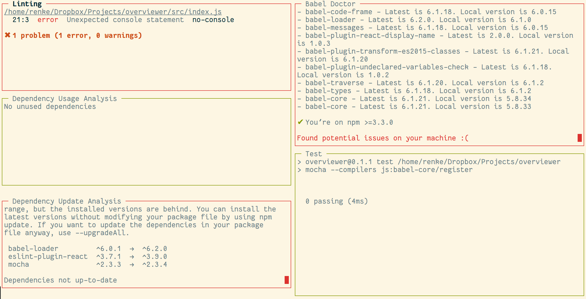

__ATTENTION: This repository is currently unmaintained.__

# Overviewer

*overviewer* lets you view the output of multiple programs at the same time. It also shows if a program failed or succeeded by using an appropriately colored border.



## Motivation

Here are some reasons why I made this project.

- I wanted to use [blessed](http://npmjs.com/package/blessed) (and more specifically [react-blessed](http://npmjs.com/package/react-blessed))
- I wanted to use [redux](http://npmjs.com/package/redux) (and to see how it compares to [Alt](http://npmjs.com/package/alt))
- I can't remember the name of many useful tools but I still want to use them…

…instead of having to remember the names of all those tools I just add them once to my `.overviewerrc` and then run `overviewer` occasionally to benefit from those tools.

## Installation ##

**Global**:

`npm install -g overviewer`

**Local**:

`npm install --save-dev overviewer`

This is the preferred way if you want integrate *overviewer* into your project's development workflow because it will be installed automatically for others who work on your project.

## Usage ##

Use `overviewer` to start it when you installed it globally and `./node_modules/.bin/overviewer` when you installed it locally (or simply `overviewer` when used as *npm* script).

Keybinding         | Action
------------------ | -------------
q, Escape, Ctrl-c  | Quit
Tab                | Focus next output
Shift-Tab          | Focus previous output
Up                 | Scroll up
Down               | Scroll down

*overviewer* doesn't have any command line flags or helpful messages as of now.

**You must have a `.overviewerrc` file in the working directory. See below.**

## Configuration ##

To specify which programs should be run by *overviewer* a `.overviewerrc` file has to be created.

**Example**:

```js
{
  "reporters": [
    {
      "title": "Linting",
      "command": "node_modules/.bin/eslint src --color",
    },

    {
      "title": "Babel Doctor",
      "command": "node_modules/.bin/babel-doctor --colors",
      "failure": "Found potential issues on your machine",
    },

    {
      "title": "Dependency Usage Analysis",
      "command": "node_modules/.bin/depcheck --dev false",
    },

    {
      "title": "Test",
      "command": "npm test",
    },

    {
      "title": "Dependency Update Analysis",
      "command": "node_modules/.bin/ncu --error-level 2",
      "success": "All dependencies match",
    },
  ],
}
```

## Feedback ##

I appreciate any kind of feedback. Just create an issue or drop me a mail. Thanks!

## License ##

See [LICENSE](LICENSE).
